# Duck Bob Logger

A high-throughput, profile-driven logging automation library for browser-based workflows that need deterministic, repeatable text injection and commit semantics.

[](https://github.com/OstinUA/Duck-Bob/actions)
[](./manifest.json)
[](./LICENSE)
[](./manifest.json)

> [!NOTE]
> This README is structured as a library-first technical specification for teams integrating the core text-injection/logging pipeline into browser automation and lead-intelligence workflows.

## Table of Contents

- [Features](#features)
- [Tech Stack & Architecture](#tech-stack--architecture)
- [Getting Started](#getting-started)
- [Testing](#testing)
- [Deployment](#deployment)
- [Usage](#usage)
- [Configuration](#configuration)
- [License](#license)
- [Contacts & Community Support](#contacts--community-support)

## Features

- Profile-driven logging dictionaries with multi-language support.
- Category-based log batch insertion from contextual UI actions.
- Deterministic event dispatch based on `InputEvent` + `KeyboardEvent` to satisfy strict framework listeners.
- Works with:
  - `input`
  - `textarea`
  - `contenteditable` targets
- Asynchronous insertion pipeline with configurable delay (`INSERT_DELAY_MS`) to reduce race conditions.
- Storage-backed active profile persistence via `chrome.storage.sync`.
- Runtime menu regeneration on profile changes (`profileChanged` message broadcast).
- Manifest V3 service-worker architecture with explicit modular boundaries.
- CI-aligned repository layout with lint/build/deploy workflow scaffolding.
- Curated dictionaries for English, Spanish, French, German, Portuguese, Polish, Czech, Italian, Turkish, and Japanese.

> [!TIP]
> The architecture is effective for “log-like” data entry streams where each token must be committed with an `Enter` boundary (e.g., tags, recruiter filters, CRM multi-value inputs).

## Tech Stack & Architecture

- Language: Vanilla JavaScript (ES-compatible patterns).
- Runtime: Chrome Extension Platform, Manifest V3.
- Browser APIs:
  - `chrome.contextMenus`
  - `chrome.scripting`
  - `chrome.storage`
  - `chrome.runtime`
- UI Layer: Popup-driven profile selector (`popup.html` + `popup.js`).
- Distribution: GitHub Actions CI/CD workflow templates.

### Project Structure

<details>
<summary>Expand complete repository tree (top-level + key modules)</summary>

```text
Duck-Bob/
├── background.js
├── manifest.json
├── popup.html
├── popup.css
├── popup.js
├── background/
│   ├── config.js
│   ├── context-menu.js
│   ├── injector.js
│   └── profile-loader.js
├── popup/
│   ├── constants.js
│   ├── storage.js
│   └── ui.js
├── profiles/
│   ├── english.js
│   ├── spanish.js
│   ├── french.js
│   ├── german.js
│   ├── portuguese.js
│   ├── polish.js
│   ├── czech.js
│   ├── italian.js
│   ├── turkish.js
│   └── japanese.js
├── .github/workflows/
│   ├── lint.yml
│   └── chrome-extension.yml
├── LICENSE
├── SECURITY.md
└── CONTRIBUTING.md
```

</details>

### Key Design Decisions

1. Module separation between orchestration (`background.js`) and responsibility-specific handlers (`background/*.js`).
2. Runtime script execution through `chrome.scripting.executeScript` keeps insertion logic close to active DOM context.
3. Defensive checks for active tab IDs, profile availability, and category payload validity reduce hard runtime failures.
4. Message-driven menu refresh avoids stale context menu state after profile updates.

```mermaid
flowchart LR
  A[User selects profile in popup] --> B[chrome.storage.sync set activeProfile]
  B --> C[popup sends profileChanged message]
  C --> D[background refreshContextMenus]
  D --> E[User right-clicks editable target]
  E --> F[Context menu category selected]
  F --> G[Resolve menu action and profile words]
  G --> H[Inject script into active tab]
  H --> I[Apply word to input/textarea/contenteditable]
  I --> J[Dispatch InputEvent]
  J --> K[Dispatch Enter keydown/keyup]
  K --> L[Delay and iterate next word]
```

<details>
<summary>Expand logging pipeline and event-flow diagram</summary>



</details>

> [!IMPORTANT]
> Event simulation is intentionally explicit to support modern SPAs where assigning `.value` alone does not trigger controlled-component updates.

## Getting Started

### Prerequisites

- Google Chrome (latest stable recommended).
- OS: macOS, Linux, or Windows with Chrome installed.
- Git (for source-based installation).
- Optional for CI/automation:
  - Node.js `20.x`
  - npm `>=9`

### Installation

1. Clone the repository:

```bash
git clone https://github.com/OstinUA/Duck-Bob.git
cd Duck-Bob
```

2. Open `chrome://extensions`.
3. Enable **Developer mode**.
4. Click **Load unpacked**.
5. Select the repository root.

> [!NOTE]
> No local build step is required for the default unpacked extension workflow.

<details>
<summary>Troubleshooting and alternative installation paths</summary>

### Common issues

- **Context menu does not appear**:
  - Ensure you right-click inside an editable field.
  - Confirm extension is enabled and has `contextMenus` permission.
- **No words inserted**:
  - Verify active profile exists and category is not empty.
  - Re-open popup and reselect profile to force menu refresh.
- **Popup closes too quickly**:
  - This is expected (`PROFILE_CLOSE_DELAY_MS = 150`).

### Build from source (optional CI simulation)

```bash
npm ci --if-present
npm run build --if-present
```

### Re-import after edits

1. Update files locally.
2. In `chrome://extensions`, click the refresh icon on the unpacked extension card.

</details>

## Testing

Run repository checks with the following commands:

```bash
# Syntax check all JS files
find . -type f -name "*.js" -print0 | xargs -0 -I{} node --check "{}"

# Optional lint if package scripts are present
npm run lint --if-present

# Optional build verification
npm run build --if-present
```

> [!WARNING]
> The CI lint workflow currently validates JavaScript syntax only under `api/` if present; adapt it to include `background/`, `popup/`, and `profiles/` for stricter coverage.

## Deployment

### Production Packaging

1. Build distribution assets if your pipeline generates a `dist/` directory.
2. Zip extension payload.
3. Upload to Chrome Web Store (draft or publish).

```bash
npm ci --if-present
npm run build --if-present
cd dist && zip -r ../extension.zip .
```

### CI/CD Integration

- Use `.github/workflows/chrome-extension.yml` as baseline for:
  - Build artifact creation
  - Artifact handoff between jobs
  - Automated Chrome Web Store draft uploads
- Required secrets for upload action:
  - `EXTENSION_ID`
  - `CLIENT_ID`
  - `CLIENT_SECRET`
  - `REFRESH_TOKEN`

<details>
<summary>Deployment hardening checklist</summary>

- Pin action versions across all workflows.
- Add branch protections for release branches.
- Enforce lint + syntax gates on pull requests.
- Introduce signed release tags and changelog generation.
- Configure staged rollout percentage in Chrome Web Store.

</details>

## Usage

### Basic Usage

```javascript
// 1) User selects a profile from the popup UI
await chrome.storage.sync.set({ activeProfile: 'profile1' });

// 2) Background receives menu selection and resolves category words
const words = selectedProfile['Programmatic'];

// 3) Injection logic dispatches input + enter for every token
for (const word of words) {
  target.dispatchEvent(
    new InputEvent('input', {
      data: word,
      inputType: 'insertText',
      bubbles: true,
      cancelable: true
    })
  );

  target.dispatchEvent(new KeyboardEvent('keydown', { key: 'Enter', code: 'Enter', keyCode: 13, which: 13, bubbles: true }));
  target.dispatchEvent(new KeyboardEvent('keyup', { key: 'Enter', code: 'Enter', keyCode: 13, which: 13, bubbles: true }));
}
```

### Workflow Example

1. Open popup.
2. Select language.
3. Select profile.
4. Focus editable target on destination site.
5. Right-click -> `Text Inserter =>` -> category.
6. Verify tags/log entries are committed sequentially.

<details>
<summary>Advanced Usage: custom profile dictionaries</summary>

You can define additional domain-specific dictionaries in `profiles/*.js` using profile IDs and category arrays.

```javascript
profiles.profile_custom = {
  'Incident Severity': ['P0', 'P1', 'P2', 'P3'],
  'Services': ['billing-api', 'identity', 'gateway', 'notification'],
  'Regions': ['us-east-1', 'eu-west-1', 'ap-southeast-1']
};
```

Use the popup constants map to expose this profile in UI selection.

</details>

<details>
<summary>Custom formatters and edge-case behavior</summary>

### Suggested formatter strategy

- Normalize whitespace before insert.
- Enforce max token length to avoid target UI truncation.
- Add deduplication for repeated words.

### Edge cases

- If `document.activeElement` changes mid-loop, insertion may drift.
- Some rich-text editors block synthetic `KeyboardEvent` and require additional triggers.
- Cross-origin iframes may not be script-injectable depending on host permissions.

</details>

## Configuration

Primary configuration is code-defined and storage-backed.

- `EXTENSION_DEFAULTS.ACTIVE_PROFILE_ID`: fallback profile when storage is empty.
- `EXTENSION_DEFAULTS.INSERT_DELAY_MS`: delay between token insertions.
- `MESSAGE_TYPES.PROFILE_CHANGED`: runtime signal for menu regeneration.
- `chrome.storage.sync.activeProfile`: persisted selected profile ID.

> [!CAUTION]
> Very low insertion delays may cause missed key commits in latency-heavy web apps; validate with realistic target forms.

<details>
<summary>Exhaustive configuration reference</summary>

| Key | Location | Type | Default | Purpose |
| --- | --- | --- | --- | --- |
| `MENU_IDS.ROOT` | `background/config.js` | `string` | `mainMenu` | Root context menu node ID |
| `EXTENSION_DEFAULTS.ACTIVE_PROFILE_ID` | `background/config.js` | `string` | `profile1` | Safe fallback profile |
| `EXTENSION_DEFAULTS.INSERT_DELAY_MS` | `background/config.js` | `number` | `40` | Word insertion pacing |
| `MESSAGE_TYPES.PROFILE_CHANGED` | `background/config.js` | `string` | `profileChanged` | Synchronization event name |
| `POPUP_DEFAULTS.PROFILE_CLOSE_DELAY_MS` | `popup/constants.js` | `number` | `150` | Delay before popup auto-close |

### Storage schema (`chrome.storage.sync`)

```json
{
  "activeProfile": "profile1"
}
```

### Runtime message payload

```json
{
  "type": "profileChanged"
}
```

</details>

## License

This project is licensed under the Apache License 2.0. See [`LICENSE`](./LICENSE) for full terms.

## Contacts & Community Support

## Support the Project

[](https://www.patreon.com/OstinFCT)
[](https://ko-fi.com/fctostin)
[](https://boosty.to/ostinfct)
[](https://www.youtube.com/@FCT-Ostin)
[](https://t.me/FCTostin)

If you find this tool useful, consider leaving a star on GitHub or supporting the author directly.
